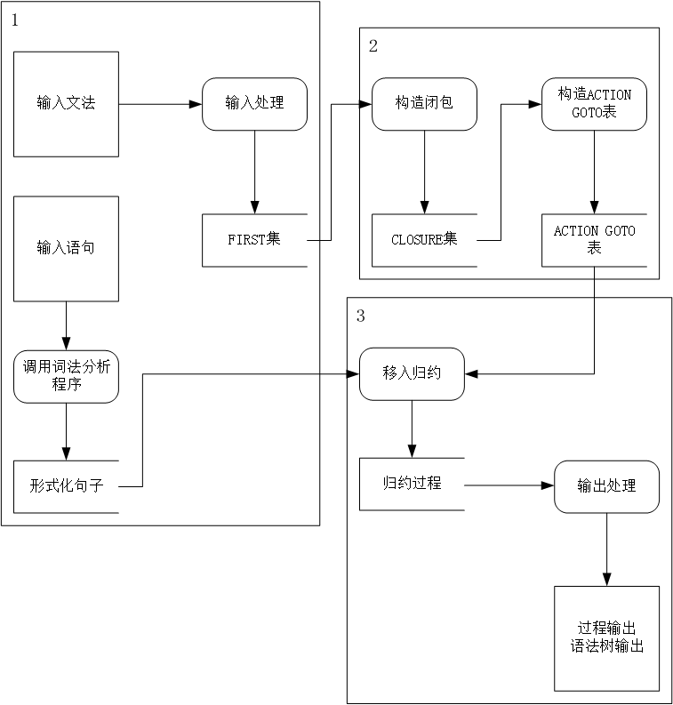

# Compiler

## Setup

1. Download *Flex* from [here](https://www.technorange.com/wp-content/uploads/Flex%20Windows%20%5BLex%20and%20Yacc%5D.exe) and install
2. Add the path of *flex.exe* and *gcc.exe* to the system environment
3. Clone the repository
4. Run the *run.bat*

## To Do

### Lex part

- [x] Rename the keywords
- [x] Rewrite the print function
- [x] Add more supporting symbols
- [ ] Add a function of pre-processing function, to read a whole sentence at once, delete comments and print the source codes

### Syntax part

- [ ] Grammar input process & create FIRST set
- [ ] Sentence input process & transform into FORMAL present
- [ ] from FIRST set to CLOSURE set
- [ ] from CLOSURE set to ACTION/GOTO table
- [ ] from FORMAL present & ACTION/GOTO table to solve the syntax
- [ ] show the result in a tree

## Requirement

### Input & Output

输入 **已知文法、单词串**

输出 **分析过程和语法树**

#### Data Flow



输入处理，变成内部的数据结构

```python
input="S->F KK | T" # use the space to spilt symbol, no space in around the ->
Grammar={
    # 'name':[symbol1List,symbol2List,...]
    'S':[[F,KK],[T]]
    'F':[...]
}
KeywordsList=['e','a',...]
```

求FIRST集

```python
FIRST={
    #'name':{first_set}
    'S':{F,T},
    'F':{...}
}
```

构造CLOSURE

```python
accept_grammar_point={
    #包括展望符号以及点的位置
    {'l':['S'],'r':['B','B'],'point':0,'forward':'a'}#0
    {...}#1
    ...
}
#输出到accept.txt
CLOSURESET={#项目集族，里面的数字对应accept_grammar_point的下标
    [0,1,3,5,7],#I0
    [2,4,6,8],#I1
    ...#In
}
#输出到CLOSURESET.txt
```

求ACTION表和GOTO表

```python
 ACTION_GOTO=[#ACTION_GO[状态i][符号j]，0为acc，x为移进，-x为用产生式x规约（这个产生式下标为accept_grammar_point的下标号    
     # [state0_ac/goto,state1_ac/goto]    
     [   # state 0 {ac:operation,goto:operation}       
         'a':#在状态0遇见a做什么       
         'S':#遇见S做什么    
     ]    
     [        # state 1...    
     ]
 ]
 #输出到ACTION_GOTO.txt
```

从输入的单词串转为形式化句子

```python
input=String() # int a=5;
FORMAL_SENTENSE=[
    START,INT,VAR,EQU,NUM,END	# defined in lex
]
```

移进/归约分析

输出 **分析过程** 和 **语法树**


## Intermediate Code

```python
codeTable=[
    [op,arg1,arg2,result]
]

nameTable={
    name:[
        	kind, #常量(constant)、变量(variable)、类型(type)、过程(procedure)
          	type, # int float
        	normal, #是否为变量形参名
        	val# address value size
    ]
}

```


1. 产生式完善+语法分析（F）
2. 词法分析输出的Value要加上去，传到语法分析模块（E）
3. 语法分析归约的时候根据归约的产生式调用对应的静态检查、翻译函数，并传递相关的值（比如关键语句，值，变量名称等）（E）
4. 静态检查：输出error，warning，出现任意一种就直接终止程序（D）
   1. 类型不匹配
   2. 未定义的变量、函数
   3. 语法错误（语法分析时检测）

5. 5类翻译（翻译的时候调用符号表查询和更新信息）
   1. 说明（C）

   2. 赋值（C）

   3. 布尔（A）

   4. 控制（B）

   5. 调用（C）

ddl：12/18，A：12/15


```c
program: declaration_list

declaration_list: declaration_list declaration
                  | declaration

declaration: var_declaration
            | fun_declaration

var_declaration: type_specifier ID ;
                // | type_specifier ID [ NUM ] ;

type_specifier: INT
               | VOID

fun_declaration: type_specifier ID ( params ) compound_stmt

params: param_list
        | VOID

param_list: param_list , param
           | param

param: type_specifier ID
       //| type_specifier ID [ ]

//compound_stmt: { local_declarations statement_list }

local_declarations: local_declarations var_declaration
                   | empty

statement_list: statement_list statement
               | empty

statement: expression_stmt
          | compound_stmt
          | selection_stmt
          | iteration_stmt
          | return_stmt

expression_stmt: expression ;
                | ;

selection_stmt: IF ( expression ) statement
               | IF ( expression ) statement ELSE statement

iteration_stmt: WHILE ( expression ) statement

return_stmt: RETURN ;
             | RETURN expression ;

expression: var = expression
           | simple_expression

var: ID
    //| ID [ expression ]

simple_expression: additive_expression
                  | simple_expression RELOP additive_expression

additive_expression: term
                    | additive_expression ADDOP term

term: factor
      | term MULOP factor

factor: ( expression )
       | var
       | call
       | NUM

call: ID ( args )

args: arg_list
      | empty

arg_list: arg_list , expression
          | expression

empty:

```


## Test data

```python
# ppt chapter 4 page 34
E->T E1
E->+ T E1 | e
T->F T1
T1->* F T1 | e
F->( E ) | i
#
+
*
e
i
(
)
#

# homework 4
S->a | b | ( T )
T->S T1
T1->, S T1 | e
#
(
)
a
b
,
e
#

# ppt chapter 5 page 120
S1->S
S->B B
B->a B
B->b

# declare varible
D->D_S
D_S->D_H D_B
D_H->KEYWORD_char | KEYWORD_int | KEYWORD_float | KEYWORD_double | KEYWORD_string
D_B->D_WV | D_WOV
D_WOV->id
D_WV->id assign VALUE
VALUE->integer | decimal | charConst | stringConst
#
integer
decimal
charConst
stringConst
id
assign
KEYWORD_char
KEYWORD_int
KEYWORD_float
KEYWORD_double
KEYWORD_string
#

```


